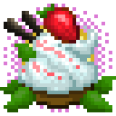

# Strawberry Twirl Companion

## About the mod

Strawberry Twirl Companion adds content, that cannot be added through other means. It adds blocks, items and fluids in a way, that is more natural to Minecraft and not currently possible through content adding mods.

## Dependencies (Optional)

These mods are not necessary, but unlock additional content for this mos. That content is meant for compability purposes to other mods.

- [Fruit Trees](https://www.curseforge.com/minecraft/mc-mods/fruit-trees)

## Supported MC versions (Java)

- 1.16.5

## Credits

### Project specific content

- Project icon and item textures are made by [Ulvra](https://www.furaffinity.net/user/ulvra)
